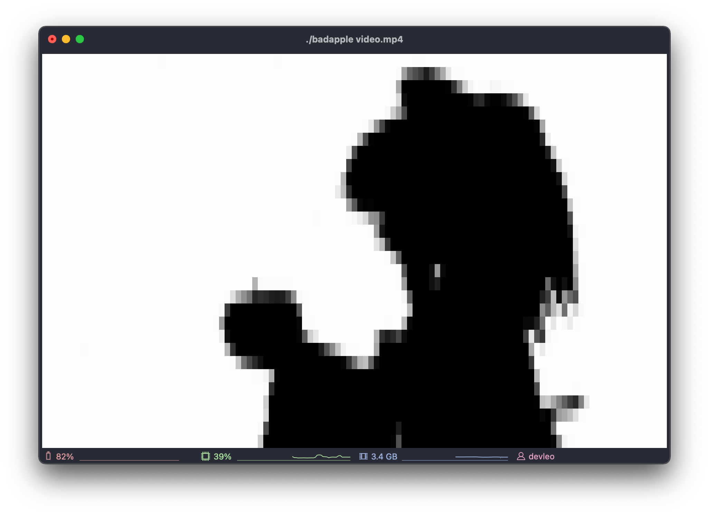
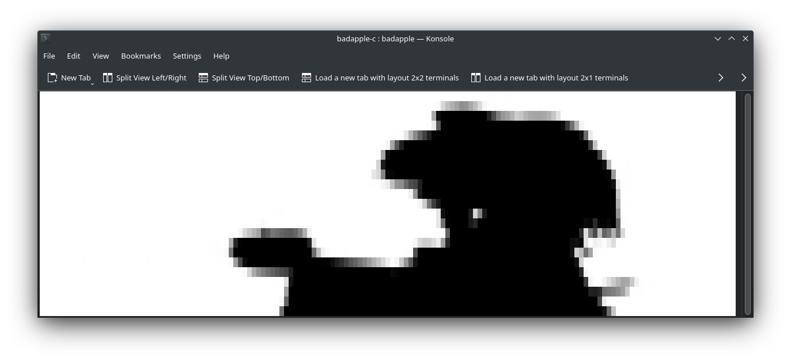

# Bad Apple!! in C

## 🚀 Installation

requires ffmpeg to use

```bash
  // Debian/Ubuntu
  apt install ffmpeg
  make
  ./badapple video.mp4
```

```bash
  // Arch Linux
  pacman -S ffmpeg
  make
  ./badapple video.mp4
```

```bash
  // Mac OS
  brew install ffmpeg
  make
  ./badapple video.mp4
```

## Screenshots

Mac OS Terminal


Arch Linux KDE Konsole

